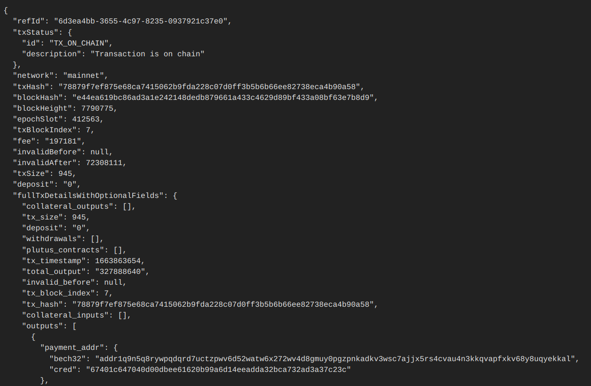

# cardanohook-support

This is the repo to raise issues for support/feedback for [Cardanohook](https://cardanohook.net/) services.
We track issue regularly here. Please be as detailed as possible while raising tickets. 

### Cardanohook - Services active at present

#### 1. Transaction monitoring with webhooks

Almost all dApp on Cardano make transactions with ADA or native assets. Once a transaction is initiated it gets added to the mempool and from then there is a delay by which the transaction is on chain and gets added into a block accepted by the network. In such situations the dApp is waiting for an update on the transaction.

**How it works:** dApps subscribe to this transaction monitoring service using a simple HTTP PUT call and receive near real time push updates from the service through webhooks.

**Benefits:** Transaction monitoring as a service for dApps to use to get updates about their transaction. DApps avoid duplicated work of periodically querying the blockchain and save effort in writing their own code for it. This service will offer Webhook based communication so that the dApps can receive updates without having to initiate a query. Better scalability through abstraction.

**Endpoint:** PUT ​/api​/v1​/subscription​/register-tx

 - Sample subscription request
----   
    curl 'https://api.cardanohook.net/api/v1/subscription/register-tx' -i -X PUT \
    -H 'Content-Type: application/json' \
    -H 'Accept: application/json' \
    -d '{
    "txHash" : "f6814bd4f4a92cfe27e33d5724b50302a16cb689472c93b729c471f9a1faaabe",
    "webhookUrl" : "https://webhook.site/14e53d90-989b-4faf-91ad-89cdfbdeab99",
    "network" : "mainnet"
    }'
----

- Acknowledgment response
----         
    {
    "txHash" : "78879f7ef875e68ca7415062b9fda228c07d0ff3b5b6b66ee82738eca4b90a58",
    "refId" : "57c1db5d-8b71-4733-8141-e4a9d3c40306"
    }
----

- Webhook response

 

